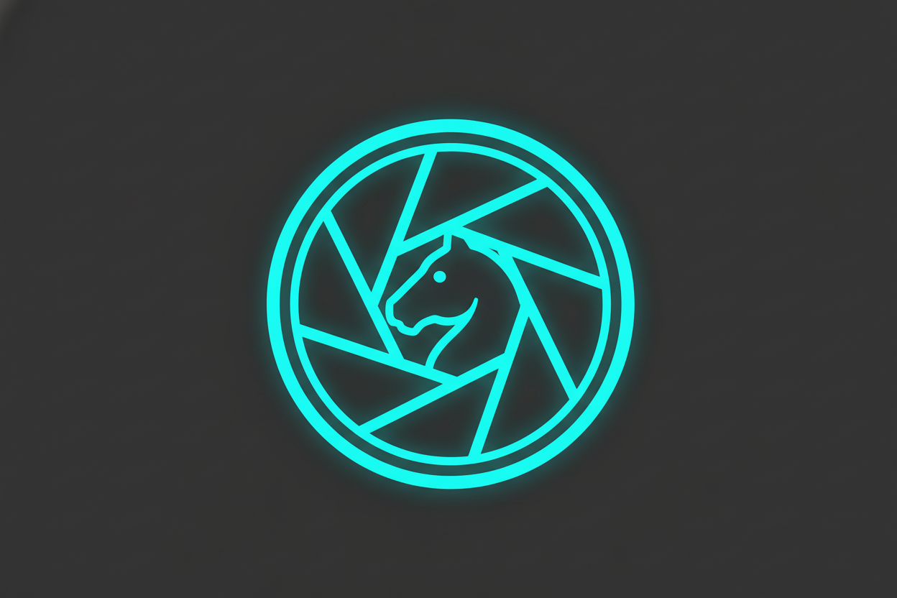

# UX Design Artifact

Generated: 2026-03-07T20:51:19.766Z

## Request

we are working on a chess clock and automated move recognizer application. Generate a suitable favicon and
app icon mockup that will also work on a phone homescreen

## Design Output

### UX Summary

The objective is to design a cohesive favicon and application icon that represents the core value proposition of the app: **Chess + Automated Vision + Time**. Because this icon will serve both as a 16x16 browser favicon and a 512x512 mobile homescreen icon, it must rely on strong silhouettes, high contrast, and minimal fine detail. The recommended concept combines a minimalist digital chess clock with a camera aperture integrated into the clock faces to signify the automated move recognition.

### User Flow

While an icon doesn't have a traditional interaction flow, the "Installation Flow" for a PWA dictates its usage:
1. **Discovery**: User opens the app in a mobile browser; the browser tab displays the 32x32 favicon.
2. **Prompt**: The browser (or custom UI) prompts the user to "Add to Homescreen" (A2HS).
3. **Homescreen Integration**: The OS uses the 192x192 or 512x512 asset, applying a standard mask (e.g., squircle on iOS, circle/teardrop on Android).
4. **App Launch**: The icon acts as the visual anchor during the splash screen while the SvelteKit app boots.

### Interaction Spec

**Responsive Scaling & Formats**
- **Favicon (16x16 / 32x32)**: Highly simplified. A single, bold silhouette of a chess knight combined with a timer contour. SVG format preferred for modern browsers, with a `.ico` fallback.
- **Homescreen / PWA Icons (192x192 / 512x512)**: PNG formats with a solid background color. Avoid transparent backgrounds for Apple Touch Icons, as iOS will fill transparency with black.
- **Maskable Icons**: Ensure the central glyph fits within the inner 80% safe zone ("maskable" design) so Android can crop it to various shapes.

**Visual Theme Constraints**
- **Shape**: A bold chess Knight profile facing right. Instead of an eye, the base of the knight seamlessly curves into a camera lens or clock face.
- **Palette**: Use a high-contrast palette (e.g., Deep Charcoal `#1A1A24` background with a Neon Cyan `#00F0FF` or Vibrant Yellow `#FFD700` glyph) to stand out among other apps and align with a "modern tech/vision" aesthetic.

### Accessibility Notes

- **Contrast Requirements**: The icon's primary glyph must have at least a 4.5:1 contrast ratio against its background to remain identifiable for users with low vision.
- **Color Independence**: The icon's meaning should not rely entirely on color; the silhouette must be instantly recognizable in grayscale.
- **Naming Context**: Ensure the PWA manifest `short_name` is concise (e.g., "ChessCam" or "AutoClock") so it does not truncate awkwardly under the icon on mobile screens.

### Implementation Handoff

**Target Files in Workspace:**
- Replace `static/favicon.png` with the new generated asset suite.
- Add `static/apple-touch-icon.png` (180x180, solid background).
- Add `static/manifest.json` (or update existing app manifest) to define PWA behavior.

**`<head>` Integration (in `src/app.html`):**
```html
<link rel="icon" href="%sveltekit.assets%/favicon.svg" type="image/svg+xml" />
<link rel="alternate icon" href="%sveltekit.assets%/favicon.ico" />
<link rel="apple-touch-icon" href="%sveltekit.assets%/apple-touch-icon.png" sizes="180x180" />
<link rel="manifest" href="%sveltekit.assets%/manifest.json" />
```

**Acceptance Criteria:**
- Visually clear at 16x16px (no muddy details).
- Fills an iOS homescreen tile without unintended black borders.
- Passes lighthouse PWA audit for installability (manifest points to valid 192x192 and 512x512 icons).

### Mockup Prompts

1. `Flat vector app icon, minimalist chess knight silhouette seamlessly merged with a camera lens aperture, modern tech aesthetic, thick bold lines, high contrast vibrant neon cyan and white glyph on a deep charcoal dark background, no text, UI design, dribbble style, perfectly centered, scalable.`

```json
{
  "type": "ux_design_result",
  "feature": "Favicon and Homescreen App Icon",
  "problem_statement": "The app needs a recognizable brand icon that scales effectively from a 16px browser tab to a 512px mobile homescreen tile while communicating its unique value: automatic camera-based chess timing.",
  "target_users": ["Desktop web users", "Mobile users installing the app as a PWA for hands-free board-side use"],
  "flows": [
    {
      "name": "Add to Homescreen",
      "steps": [
        "User visits the web app",
        "Browser presents 'Add to Homescreen' prompt",
        "OS fetches high-res icon and short name from manifest",
        "App is saved as a first-class icon on the device"
      ]
    }
  ],
  "interaction_spec": {
    "layout": "Centered glyph occupying 70-80% of the canvas to allow for safe-zone maskable cropping on Android and iOS squircles.",
    "states": [
      "Light mode / Dark mode (for SVG favicons using prefers-color-scheme media queries)",
      "Standalone PWA splash screen display"
    ],
    "accessibility": [
      "Minimum 4.5:1 contrast ratio between foreground glyph and background.",
      "Identifiable via silhouette alone (grayscale safe)."
    ]
  },
  "mockup_prompts": [
    "Flat vector app icon, minimalist chess knight silhouette seamlessly merged with a camera lens aperture, modern tech aesthetic, thick bold lines, high contrast vibrant neon cyan and white glyph on a deep charcoal dark background, no text, UI design, dribbble style, perfectly centered, scalable."
  ],
  "implementation_handoff": {
    "components": [
      "App Icon Assets (SVG, PNG, ICO)",
      "Web App Manifest"
    ],
    "files": [
      "static/favicon.png",
      "static/favicon.svg",
      "static/apple-touch-icon.png",
      "static/manifest.json",
      "src/app.html"
    ],
    "acceptance_checks": [
      "Favicon renders clearly at 16x16 in Chrome/Firefox/Safari tabs",
      "Apple Touch icon uses a solid background to prevent black rendering",
      "manifest.json correctly maps 192x192 and 512x512 maskable icons"
    ]
  }
}
```

## Mockups



