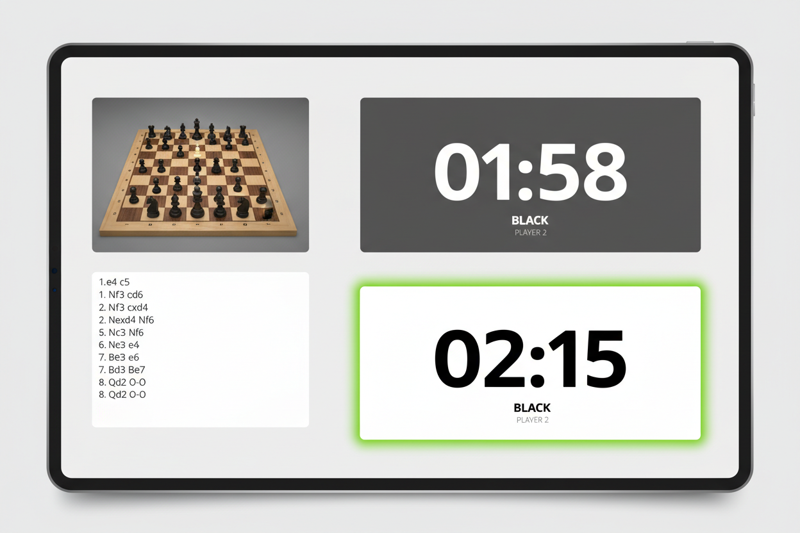

# UX Design Artifact

Generated: 2026-03-09T13:15:31.479Z

## Request

read the markdown in the designs directory and produce mockups for the broken links in the PWA design document.

## Design Output

### Design Evolution & Rationale

The previous dashboard design relied too heavily on grayscale minimalism, making it difficult to determine the active player at a glance, and featured ambiguous, undersized touch targets for turn switching. The revised mockup prioritizes clear visual hierarchy and state indication by adding distinct border highlights for the active turn, stark black/white contrast for WCAG AAA compliance, and reinforcing that the entire clock card acts as a massive touch target.

### UX Summary
The goal is to provide clear, actionable interface specifications and missing mockup replacements for the automatic Chess Clock PWA. The application requires a highly legible, distraction-free interface that gracefully balances the primary utility (digital clocks) with the secondary utilities (live IP camera feed verification and algebraic move logging). The design embraces a robust, mobile-responsive layout suitable for tablets or phones placed next to a physical chessboard.

### User Flow
1. **App Initialization & Setup:**
   - User launches the PWA. 
   - Initial state prompts for an IP camera stream URL and Time Control selection (e.g., 5 min + 3 sec increment).
   - User tests the camera connection (a small preview feed appears).
2. **Active Match:**
   - User starts the match. 
   - The UI transitions to the **Active Match View**. 
   - The interface splits: large interactive tap areas for the clocks (if manual override is needed), alongside the auto-updating move list and a minimized view of the camera feed for confidence tracking.
3. **Endgame & Post-Match:**
   - A clock reaches 0:00 or a checkmate is detected via the move engine. 
   - The clock area highlights the winner.
   - User is presented with options to 'Export PGN' or 'Rematch'.

### Interaction Spec
**Layout:**
- **Landscape (Tablet/Desktop):** Left column (30% width) contains the live camera feed (top) and scrolling move log (bottom). Right column (70% width) is vertically split into two massive digital clock faces (Black on top, White on bottom).
- **Portrait (Mobile):** Stacked. Camera feed is minimized into a top-right picture-in-picture or collapsible accordion. The primary screen real estate is dedicated to the two vertically stacked clocks.

**States:**
- **Idle/Setup:** Form elements visible, clocks dimmed.
- **Active Player:** Clock background turns distinct active color (e.g., bright white or distinct light gray for White, solid deep gray/black for Black). Timer text pulses slightly on the final 10 seconds.
- **Waiting Player:** Clock background dims. Opacity drops to 50% to visually recede.
- **Manual Override:** Tapping either clock pauses the auto-detection and allows manual turn toggling or time adjustment via a long-press modal.

### Accessibility Notes
- **Contrast:** The clocks must adhere to WCAG AAA contrast ratios, as they need to be readable from up to 3 feet away under variable room lighting.
- **Touch Targets:** The entire clock bounding box must serve as a tap target for manual overrides. Minimum touch target sizes of 48x48px are strictly enforced for all secondary buttons (settings, pause).
- **Visual Cues:** Do not rely solely on color to indicate the active turn. Use an animated border or bold/enlarged typography for the active player's remaining time.

### Mockup Prompts
1. `Mid-fidelity wireframe of a chess clock web app interface in landscape tablet orientation. The left side shows a live IP camera feed of a physical chessboard and a scrolling list of chess moves in algebraic notation. The right side features two large digital countdown timers stacked vertically. Clean, minimalist UI, highly legible sans-serif typography, high contrast, flat design.`

### Implementation Handoff
This spec defines the foundational views needed to unblock front-end component creation in Svelte.

- **Target Files to Create/Update:**
  - `docs/designs/pwa-ux-spec.md` (Main markdown design document housing this spec)
  - `docs/designs/assets/pwa-main-match-view.png` (Source-of-truth mockup asset representing the active match state)

- **Suggested Svelte Components (Mental Model):**
  - `<AppShell />`: Handles responsive routing and layout switching between portrait/landscape.
  - `<SetupForm />`: Captures IP camera URL and time controls.
  - `<DigitalClock active={boolean} timeRemaining={number} />`: The core timer component.
  - `<CameraFeed url={string} status={string} />`: Wrapper for the video stream.
  - `<MoveLog moves={array} />`: Auto-scrolling list of algebraic notations.

```json
{
  "type": "ux_design_result",
  "feature": "PWA Design Document Mockups and Spec",
  "problem_statement": "The existing PWA design documentation lacks visual references and concrete interaction structures for the core camera-driven chess clock interface.",
  "target_users": [
    "Over-the-board chess players wanting an automated clock",
    "Chess streamers needing a digital overlay companion"
  ],
  "flows": [
    {
      "name": "Match Setup to Play",
      "steps": [
        "User opens PWA and navigates to setup",
        "User enters IP camera URL and selects time control",
        "User taps 'Start Game'",
        "UI transitions to Match View with live feed, active clocks, and empty move log"
      ]
    }
  ],
  "interaction_spec": {
    "layout": "Responsive split screen: Clocks dominate the primary real estate. Camera feed and move log are relegated to a side panel (landscape) or collapsible header (portrait).",
    "states": [
      "Active Player: High contrast background, bold typography, active border indicator",
      "Waiting Player: Dimmed background, 50% opacity text",
      "Low Time Warning: Text color shifts to red/warning, subtle pulsing animation on final 10 seconds"
    ],
    "accessibility": [
      "WCAG AAA compliant contrast for clock timers",
      "Full-pane touch targets for manual clock interactions",
      "Non-color-dependent active state indicators (e.g., borders, font weight)"
    ]
  },
  "mockup_prompts": [
    "Mid-fidelity wireframe of a chess clock web app interface in landscape tablet orientation. The left side shows a live IP camera feed of a physical chessboard and a scrolling list of chess moves in algebraic notation. The right side features two large digital countdown timers stacked vertically. Clean, minimalist UI, highly legible sans-serif typography, high contrast, flat design."
  ],
  "implementation_handoff": {
    "components": [
      "AppShell",
      "SetupForm",
      "DigitalClock",
      "CameraFeed",
      "MoveLog"
    ],
    "files": [
      "docs/designs/pwa-ux-spec.md",
      "docs/designs/assets/pwa-main-match-view.png"
    ],
    "acceptance_checks": [
      "Layout responds correctly between portrait (stacked) and landscape (side-by-side) modes",
      "Clock text is legible from a distance of at least 3 feet",
      "Active player state is visually distinct without relying solely on color",
      "Camera feed component fails gracefully if the stream URL is unreachable"
    ]
  }
}
```

## Declared Deliverables

- docs/designs/pwa-ux-spec.md
- docs/designs/assets/pwa-main-match-view.png

## Mockups



