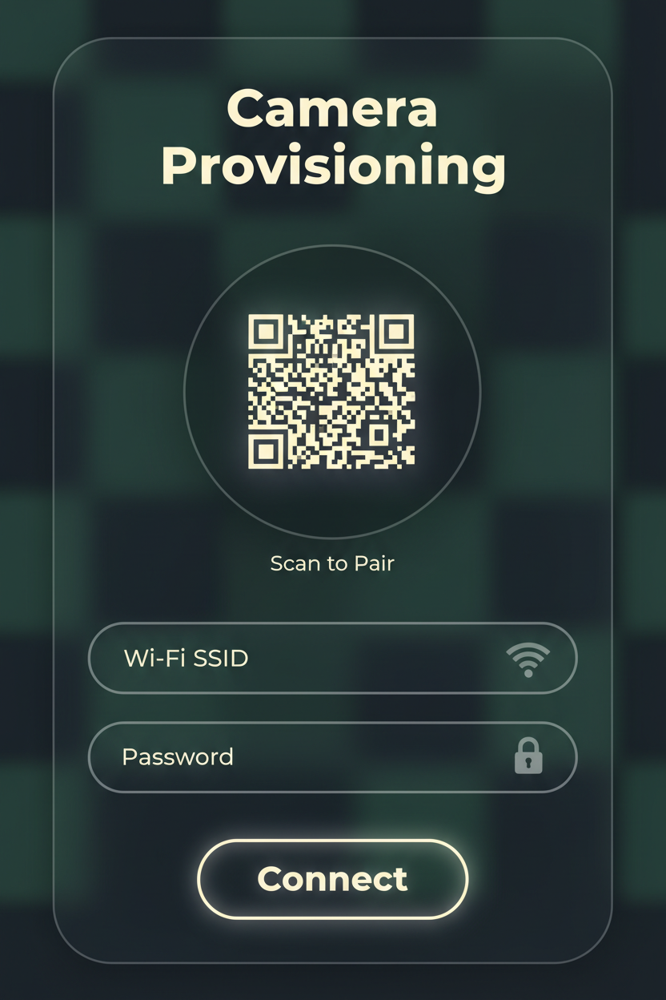
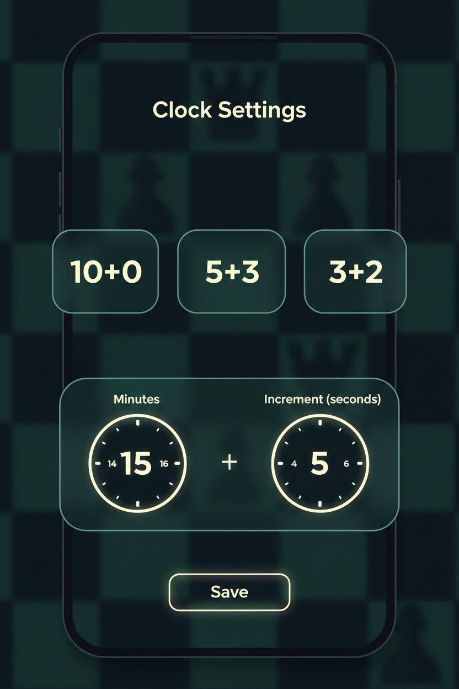
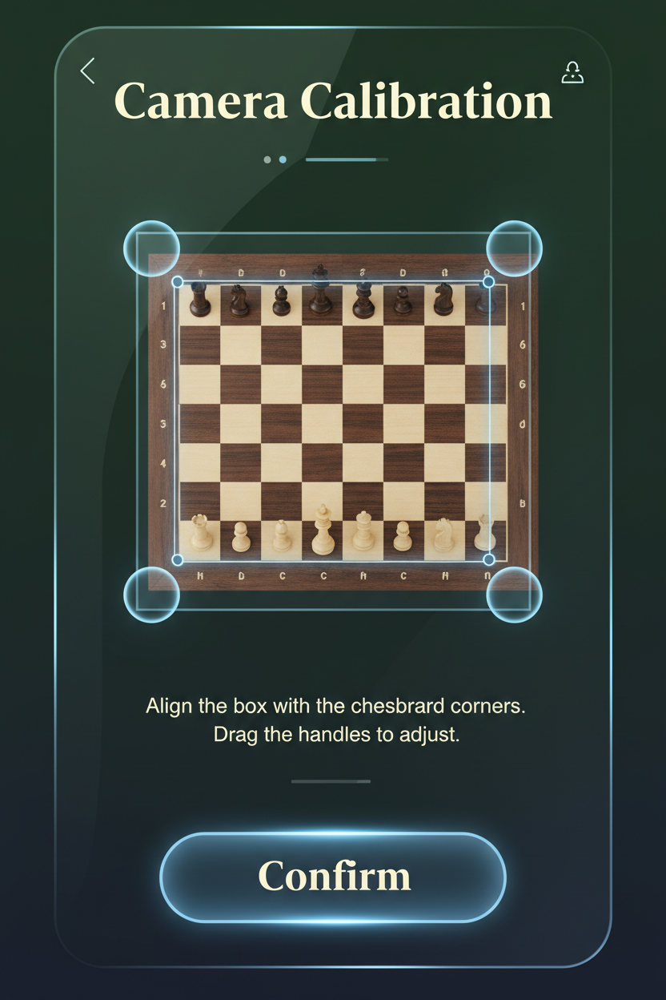
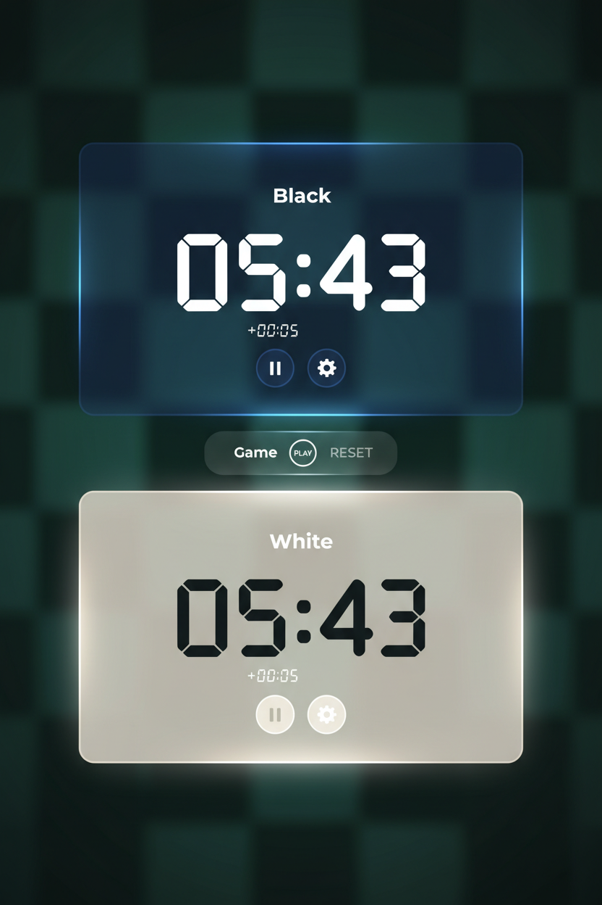
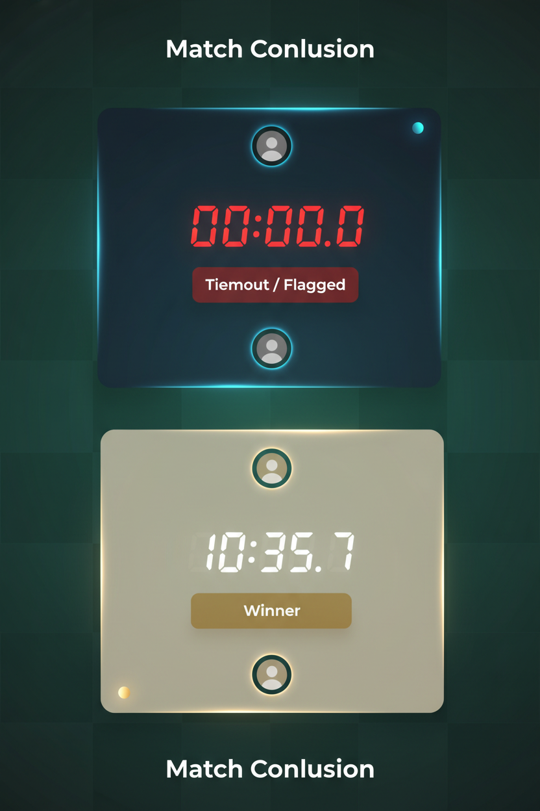

# Design Document: Chess Clock PWA

## 1. Overview
The Chess Clock PWA is a modern, web-based application designed to run on a user's smartphone. It functions as a standard, feature-rich chess clock with the added capability to pair with a dedicated IP camera (e.g., Seeed Studio XIAO ESP32S3). Once paired, the PWA uses computer vision to detect chess moves automatically and advance the clock, eliminating the need for players to manually hit the clock after every move.

## 2. Core Features
- **Traditional Chess Clock Interface:** Dual timers with millisecond precision, pause/play functionality, and manual tap zones.
- **Time Controls:** Support for standard time controls (e.g., Blitz 5+3, Rapid 10+0) and custom configurations (base time and increment).
- **Camera Provisioning & Pairing:** A QR-code-based flow to securely send Wi-Fi credentials and a pairing token to the camera.
- **Board Calibration:** A live MJPEG preview allowing the user to align and define the bounds of the chessboard for accurate computer vision processing.
- **Computer Vision Auto-Advancement:** Background polling of camera snapshots (`/capture`) drawn to a hidden `<canvas>`, running image differencing and "hand-over-board" detection to automatically toggle the active timer.

## 3. User Stories

The following user stories define the sequence of implementation and follow the format established in the E2E guide. They serve as the basis for the upcoming specific test cases.

# Test: Camera Provisioning

## User pairs the camera via QR code

**Verifications:**
- [ ] User can input Wi-Fi SSID and Password in the settings screen.
- [ ] PWA generates a QR code containing the credentials and a unique pairing token.
- [ ] PWA displays a waiting indicator while scanning for the camera's mDNS (`chess-cam.local`) or local IP.
- [ ] PWA successfully connects to the camera and authenticates using the token.

# Test: Clock Settings

## User sets up a new game's time controls

**Verifications:**
- [ ] User can select from predefined time controls (e.g., 10+0, 5+3, 3+2).
- [ ] User can create a custom time control with base minutes and increment in seconds.
- [ ] Both timers accurately reflect the correct starting time before the game begins.

# Test: Auto-Advancement Calibration

## User calibrates the camera's view of the chessboard

**Verifications:**
- [ ] PWA displays a live MJPEG stream from the paired camera's `/stream` endpoint.
- [ ] User can interactively set the bounding box or four corners of the chessboard to define the image processing area.
- [ ] PWA saves the calibration settings to local storage.

# Test: Game Play (Auto-Tracking)

## PWA tracks moves and advances the clock automatically

**Verifications:**
- [ ] PWA polls the camera's `/capture` endpoint at a defined framerate (e.g., 2-5 FPS).
- [ ] PWA processes frames to detect a "hand over board" state and pauses move evaluation until the hand clears.
- [ ] PWA detects piece movement by comparing the before and after stable board states.
- [ ] PWA automatically stops the current player's timer, applies increment, and starts the opponent's timer.
- [ ] User can manually tap their half of the screen to trigger the clock, safely overriding auto-tracking.

# Test: Match Conclusion

## Game ends via timeout or manual intervention

**Verifications:**
- [ ] When a timer reaches 00:00.0, the PWA visually flags the player whose time ran out.
- [ ] The auto-tracking system halts further clock advancements.
- [ ] User can manually pause the game at any time, resetting the clocks if required.
