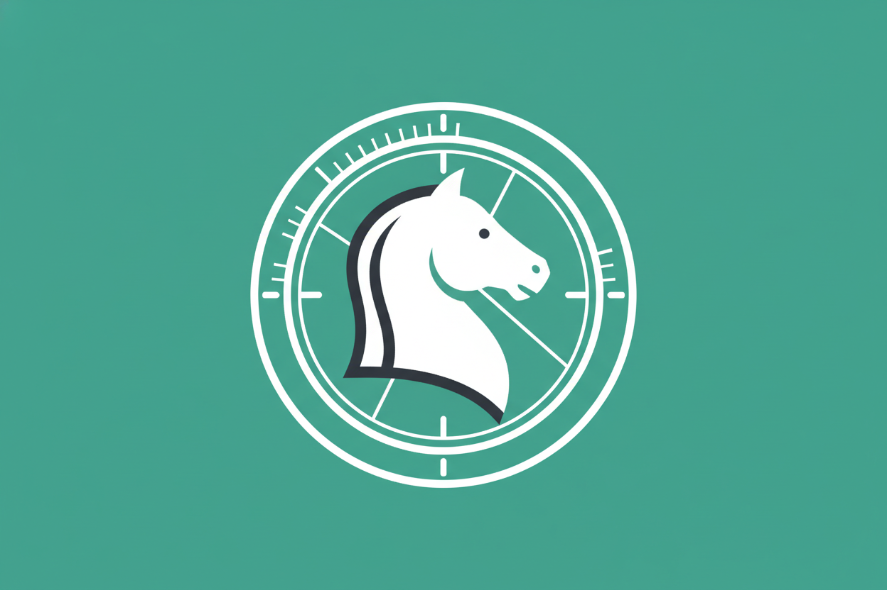

# UX Design Artifact

Generated: 2026-03-07T23:59:06.920Z

## Request

design and generate a PR-ready favicon/app-icon package for the chess clock app, using repository paths
  suitable for this project
and push up the branch/make the PR

## Design Output

### UX Summary
The chess clock app requires a distinct, highly legible favicon and app icon package to establish branding, improve tab-switching efficiency, and enable "Add to Homescreen" (PWA) workflows. Given the app's unique value proposition—an *automatic* chess clock via camera vision—the visual metaphor should combine a recognizable chess element (e.g., a Knight) with a subtle time or lens motif. The design must remain crisp at 16x16 pixels while scaling beautifully up to 512x512 for mobile app icons.

### User Flow
While icons are static assets, they directly enable the following user flows:
1.  **Browser Multitasking**: Users identifying the active chess clock among dozens of open browser tabs.
2.  **App Installation**: Users utilizing "Add to Home Screen" on iOS/Android to treat the web app as a native clock on their device.
3.  **Bookmarking**: Saving the GitHub Pages deployment URL for offline or repeated use.

### Interaction Spec
*   **Layout & Safe Zones**: The source icon (512x512) must maintain a 20% safe zone margin to accommodate both iOS "squircle" masks and Android circular masks without clipping the primary motif.
*   **Color & Contrast**: 
    *   Use a high-contrast palette (e.g., stark black/white motif on a vibrant accent background like electric blue or deep emerald) to ensure visibility against both light and dark browser themes.
    *   Avoid transparent backgrounds for the primary PWA icon; use transparency only for the `.ico` or small `.png` tab favicons.
*   **Silhouette**: The icon must have a strong, readable silhouette—a complex camera + clock + board is too noisy. Opt for a sleek Knight enclosed in a minimal clock-dial ring.

### Accessibility Notes
*   **Color Blindness**: The icon must not rely solely on color to be recognizable; the shape/silhouette must be distinct.
*   **Low Vision**: Ensure the icon's background provides a minimum contrast ratio of 3:1 against standard browser tab colors (light gray, dark gray, black).

### Implementation Handoff
To implement the app icon package, we will establish a high-resolution source-of-truth image and document the meta-tag requirements for the application shell. 

**Assets to create/update:**
1.  `static/icon-512.png` (Source of truth asset, flat vector style)
2.  `docs/ux/app-icon.md` (Design documentation and export specs)
3.  `static/manifest.json` (Web app manifest referencing the new icon)

*(Note: The build pipeline or a manual export step will later derive the 16x16, 32x32, 192x192, and apple-touch-icon sizes from the 512x512 source).*

### Mockup Prompts
1.  `A minimalist, flat vector app icon for an automatic chess clock. The design features a stylized silhouette of a chess Knight seamlessly integrated with a subtle analog clock dial or camera aperture ring. High contrast, clean lines, scalable design. Emerald green background with a crisp white and dark charcoal graphic. No text, modern UI aesthetic, Dribbble style.`

---

```json
{
  "type": "ux_design_result",
  "feature": "Favicon and App Icon Package",
  "problem_statement": "The app lacks a unified, recognizable app icon and favicon, hindering tab recognition and preventing a polished 'Add to Homescreen' PWA experience.",
  "target_users": ["Desktop browser multitaskers", "Mobile users installing the app via Add to Homescreen"],
  "flows": [
    {
      "name": "PWA Installation",
      "steps": ["User opens app in mobile browser", "User selects 'Add to Home Screen'", "OS reads manifest.json and icon-512.png", "App appears natively on device home screen"]
    }
  ],
  "interaction_spec": {
    "layout": "512x512 canvas with a 20% padding safe zone for OS masking (squircle/circle).",
    "states": ["Light mode tab context", "Dark mode tab context", "OS Home screen mask"],
    "accessibility": ["High contrast silhouette", "Color-blind safe palette (relying on shape)"]
  },
  "mockup_prompts": [
    "A minimalist, flat vector app icon for an automatic chess clock. The design features a stylized silhouette of a chess Knight seamlessly integrated with a subtle analog clock dial or camera aperture ring. High contrast, clean lines, scalable design. Emerald green background with a crisp white and dark charcoal graphic. No text, modern UI aesthetic, Dribbble style."
  ],
  "implementation_handoff": {
    "components": ["Web Manifest", "App Shell <head> tags"],
    "files": [
      "docs/ux/app-icon.md",
      "static/icon-512.png",
      "static/manifest.json"
    ],
    "acceptance_checks": [
      "Icon is clearly legible at 16x16px.",
      "manifest.json correctly references icon-512.png.",
      "Icon does not clip when masked to a circle or squircle."
    ]
  }
}
```

## Declared Deliverables

- docs/ux/app-icon.md
- static/icon-512.png
- static/manifest.json

## Mockups



