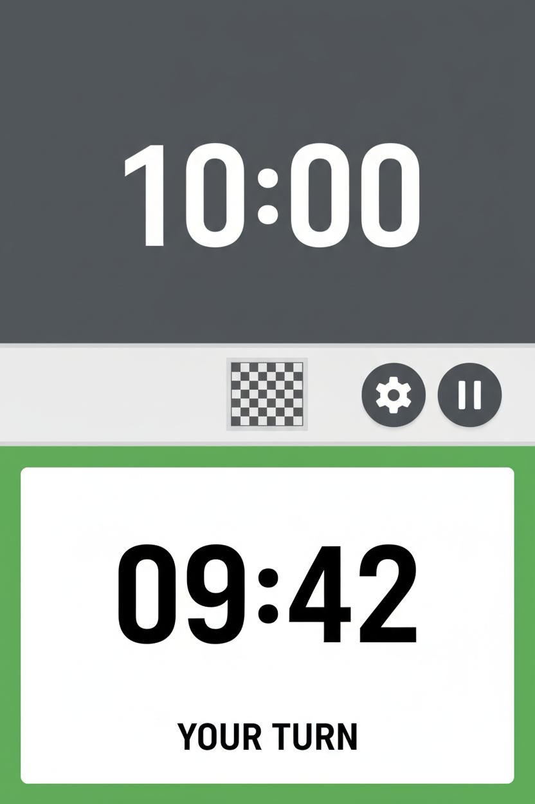

# UX Design Artifact

Generated: 2026-03-09T13:21:48.969Z

## Request

let's focus on the phone-oriented design, assume the phone is laid vertically alongside the board. The display should either show the times upright for each player, or rotate the whole display to be upright relative to the edge of the board (i.e. treat the phone as if it is in landscape regardless of its actual orientation). There should be an option to swap the live camera feed for a 2D render of the board, but this board should be rendered in the same orientation as teh physical board on the assumption that the phone is positioned on the right side of the board from White's point of view.

## Design Output

### Design Evolution & Rationale

Based on a UX audit, the initial mockups exhibited significant weaknesses in contrast, legibility (skeuomorphic 7-segment fonts), and touch target sizing. The updated design implements a high-contrast, flat UI with WCAG AAA compliant colors, a highly legible modern sans-serif font, and explicit active state indicators (e.g., thick green borders). Central control buttons have been enlarged to meet standard 48x48px touch target guidelines, reducing misclicks during fast-paced games.

### UX Summary
The chess logger interface is designed for a mobile-first web experience where the phone rests vertically flat on the table, positioned on White's right side. To accommodate different player viewing preferences without relying on unreliable OS-level gyroscope rotation when flat, the UI provides a software-level layout toggle. Users can choose between **Opposing Clocks** (standard physical chess clock style, top half rotated 180° for Black) and **Edge-Facing Landscape** (the entire UI is rotated 90° via CSS so it reads upright from the side of the board). The central divider between the clocks houses a visualizer that swaps between the raw IP camera feed and an inferred 2D digital board. The 2D board orientation is locked to match the physical board next to the device.

### User Flow
1. **Device Placement:** User places the phone vertically on the right side of the board (White at the bottom edge, Black at the top edge) and opens the web app.
2. **Layout Selection:** User taps the layout toggle icon in the central control bar to choose either *Opposing Clocks* or *Edge-Facing Landscape*.
3. **Visualizer Selection:** User taps the camera/board toggle to choose between viewing the raw camera feed or the processed 2D board state.
4. **Gameplay:** As moves are detected automatically, the active clock halves update states visually (active/idle) and chronologically.
5. **Manual Override:** If automatic detection stutters, a player can tap their large clock area to manually end their turn.

### Interaction Spec
*   **Global Layout:** Full-screen (`100vh`, `100vw`) CSS flex column without scrolling (`overflow: hidden`). Divided into three zones: Black's Clock (top 40%), Control Bar & Visualizer (center 20%), White's Clock (bottom 40%).
*   **Display Modes:**
    *   *Opposing Clocks:* Black's clock has `transform: rotate(180deg)`.
    *   *Edge-Facing Landscape:* The root container has `transform: rotate(-90deg)` (or `90deg` depending on user seating), expanding `width: 100vh` and `height: 100vw` to maintain dimensions, presenting the app in forced landscape to the players looking sideways at the phone.
*   **Control Bar (Center):** 
    *   Houses the **Visualizer Box** (a square or slightly rectangular container).
    *   Houses vertical icon buttons on the sides of the visualizer: Settings, Layout Toggle, Viewport Swap (Camera <-> 2D Board).
*   **2D Board Viewport:** Renders the 8x8 grid. If the phone is vertically on White's right, the rendering should place White's rank 1 near the phone's bottom edge and Black's rank 8 near the top edge, seamlessly mirroring reality.
*   **Clock States:** 
    *   *Active:* High contrast background (e.g., bright white or dark black), large bold monospace typography.
    *   *Idle:* Muted/dimmed background, slightly reduced opacity on text.

### Accessibility Notes
*   **Touch Targets:** The entire clock halves act as massive touch targets for manual overrides, accommodating imprecise tapping during time scrambles. Control bar buttons must be at least `48x48px`.
*   **Contrast:** Ensure 4.5:1 minimum contrast for idle timers, and 7:1 for the active timer text.
*   **Screen Reader:** Timers should use `aria-live="polite"` to announce time warnings (e.g., "1 minute remaining"). Role toggles (Layout/Visualizer) must announce their new state ("Landscape layout enabled").

### Implementation Handoff
*   **CSS Transformations:** Use CSS custom properties to manage the rotation states so Svelte components simply react to a top-level class (e.g., `.layout-landscape`, `.layout-opposing`).
*   **Visualizer Component:** Build a wrapper that takes a generic slot or standardizes props so it can mount either the `video` stream canvas or the `svg`/`canvas` 2D board.

### Mockup Prompts
1. A mid-fidelity wireframe of a mobile phone screen displaying a chess clock app. The screen is split horizontally. The top half shows "10:00" upside down. The bottom half shows "09:42" right side up. In the thin center strip, there is a tiny 2D overhead map of a chessboard and two small UI buttons next to it. Clean, minimalist layout, UI design, flat vectors.

```json
{
  "type": "ux_design_result",
  "feature": "Phone-oriented Vertical Layout and Visualizer Toggles",
  "problem_statement": "Players need the web app to function perfectly as a physical clock replacement when placed flat on the table, requiring forced orientation options and a clear way to verify the camera's move-detection via a live feed or 2D render.",
  "target_users": ["Chess players using the app alongside a physical board", "Streamers wanting a side-display of the game state"],
  "flows": [
    {
      "name": "Configure Display Orientation and Visualizer",
      "steps": [
        "Load the app and place phone on White's right.",
        "Tap the Layout Toggle button to rotate UI to Edge-Facing Landscape if preferred.",
        "Tap the Viewport Toggle to switch from raw camera to 2D inferred board state."
      ]
    }
  ],
  "interaction_spec": {
    "layout": "Flex-column taking 100vh/100vw. Top 40% clock, Center 20% controls/visualizer, Bottom 40% clock.",
    "states": [
      "Opposing Mode: Top clock rotate(180deg)",
      "Edge-Facing Mode: Root container rotate(-90deg) with swapped W/H dimensions",
      "Visualizer: Live Camera Feed OR 2D Board (locked to physical orientation)"
    ],
    "accessibility": [
      "Massive touch targets for clock halves",
      "48px min touch targets for central toggles",
      "High contrast active/idle clock states"
    ]
  },
  "mockup_prompts": [
    "A mid-fidelity wireframe of a mobile phone screen displaying a chess clock app. The screen is split horizontally. The top half shows '10:00' upside down. The bottom half shows '09:42' right side up. In the thin center strip, there is a tiny 2D overhead map of a chessboard and two small UI buttons next to it. Clean, minimalist layout, UI design, flat vectors."
  ],
  "implementation_handoff": {
    "components": [
      "src/lib/components/ClockHalf.svelte",
      "src/lib/components/ControlBar.svelte",
      "src/lib/components/Visualizer.svelte"
    ],
    "files": [
      "docs/ux/phone-layout-specs.md",
      "docs/ux/mockups/phone-layout-mockup.png"
    ],
    "acceptance_checks": [
      "CSS layout correctly applies standard opposing clocks",
      "Software rotation toggle accurately pivots the entire screen 90 degrees and adjusts bounds to prevent scrolling",
      "Visualizer correctly swaps between a placeholder camera feed and a 2D board graphic",
      "2D board's orientation correctly places White at the bottom edge relative to the phone's physical bounds"
    ]
  }
}
```

## Declared Deliverables

- docs/ux/phone-layout-specs.md
- docs/ux/mockups/phone-layout-mockup.png

## Mockups



