# Chessboard Localization Test Report

Detector strategy: detect square-like contours, keep the dominant connected square cluster, fit a board envelope from those squares, then refine the quad using lattice support, color separation, and grid-line alignment.

| Original | Detected Board | Square Candidates | Edge Map | Rectified Board | Metrics |
|----------|----------------|-------------------|----------|-----------------|---------|
|  |  | 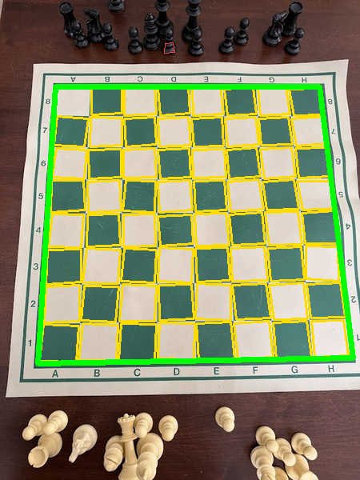 | 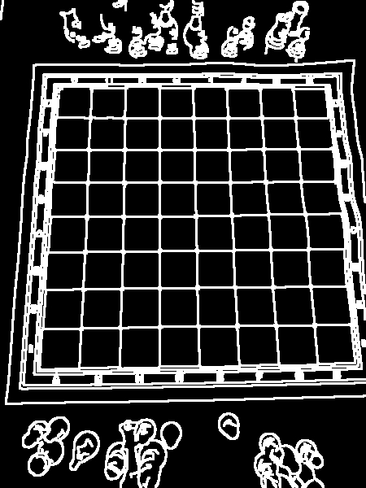 | 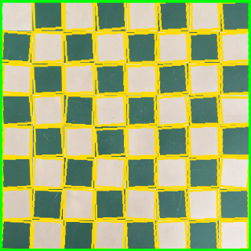 | score=1241.5, candidates=64, selected=63, cells=63, inside=63, residual=0.024, color=213.0, spread=18.9, cellStd=2.2, lineDelta=47.79 |
|  |  | 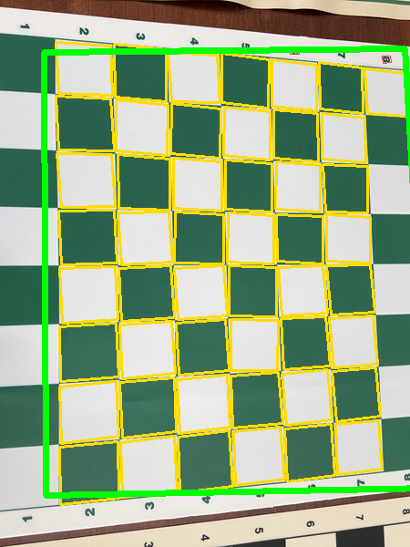 | 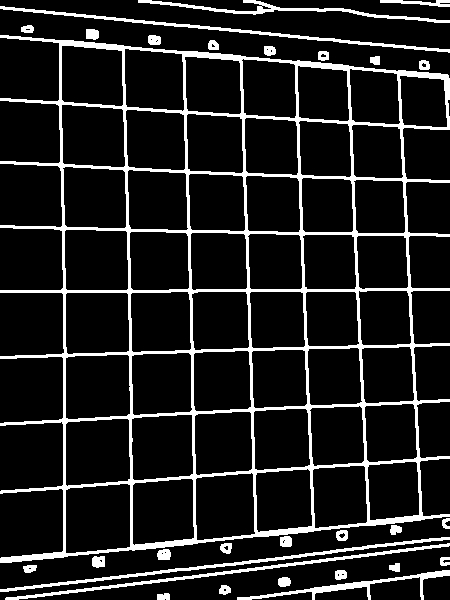 | 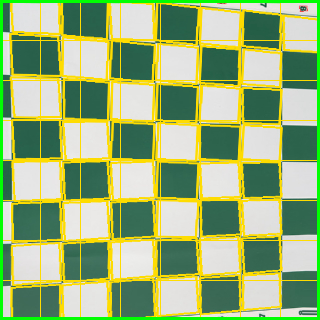 | score=803.0, candidates=51, selected=49, cells=49, inside=49, residual=0.224, color=166.3, spread=122.6, cellStd=24.3, lineDelta=22.97 |
|  |  | 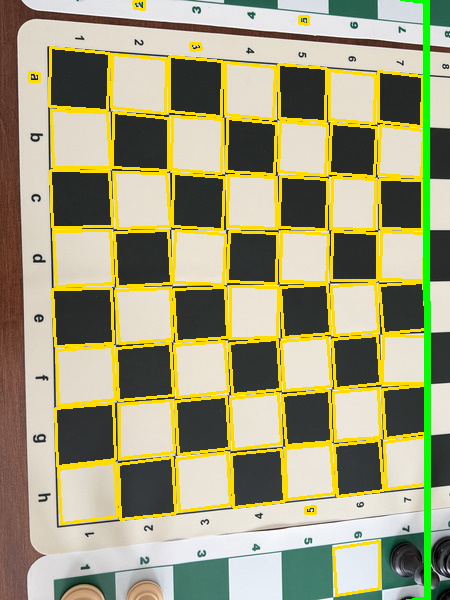 | 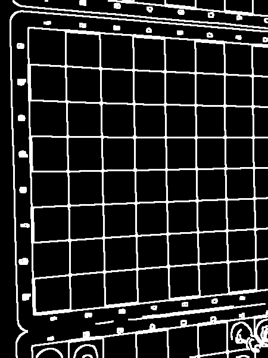 | 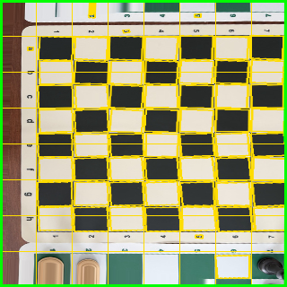 | score=818.5, candidates=62, selected=62, cells=47, inside=62, residual=0.198, color=66.6, spread=153.7, cellStd=59.6, lineDelta=34.27 |
|  |  | 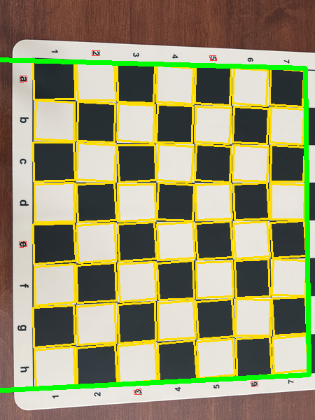 | 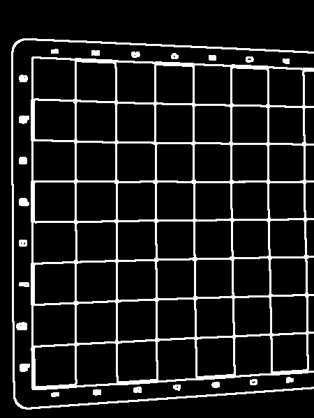 | 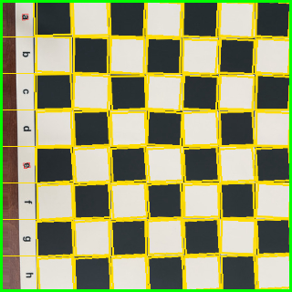 | score=1267.1, candidates=62, selected=56, cells=56, inside=56, residual=0.030, color=267.6, spread=67.9, cellStd=9.5, lineDelta=60.25 |
|  |  | 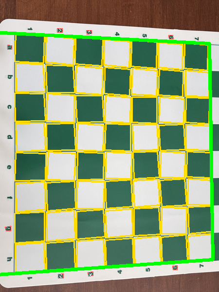 | 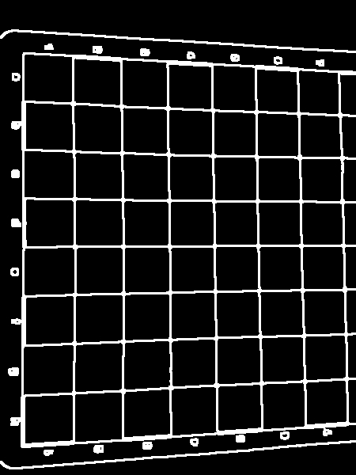 | 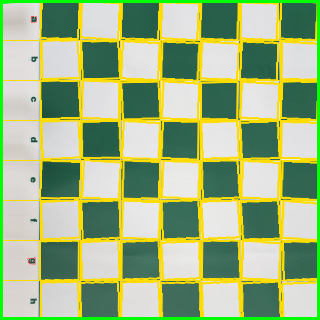 | score=1185.2, candidates=64, selected=56, cells=56, inside=56, residual=0.020, color=227.1, spread=63.0, cellStd=2.6, lineDelta=52.96 |
| 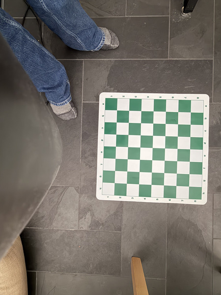 | 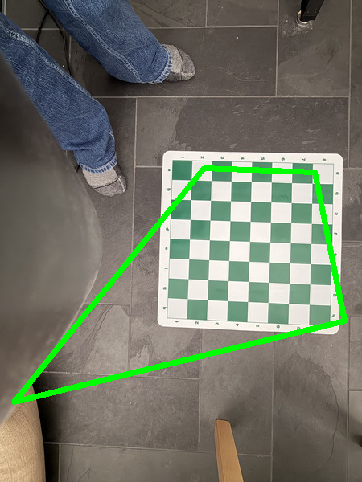 | 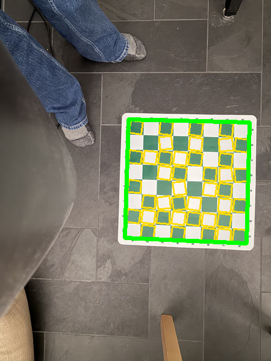 | 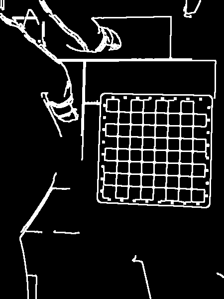 | 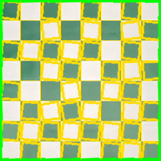 | score=933.2, candidates=41, selected=41, cells=41, inside=41, residual=0.018, color=195.0, spread=22.9, cellStd=1.8, lineDelta=43.54 |
