# Chessboard Occupancy Test Report

Board localization is anchored to `tests/images/game/empty.jpg`, and that fixed grid is reused for the whole game sequence. After setup, occupancy selection assumes 32 pieces remain on the board and each successive frame differs by one move. Move labels below come from the filename sequence, not piece recognition.

Reference board score: 933.2. Lattice cells matched: 41. Color separation: 195.0.

| Step | Occupancy Overlay | Warped Occupancy | Move Label | Occupied | State Delta |
|------|-------------------|------------------|------------|----------|-------------|
| 00-empty | 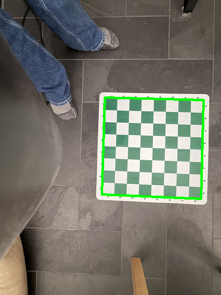 | 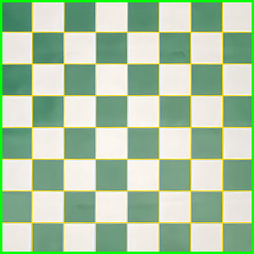 | - | 0 | - |
| 01-initial | 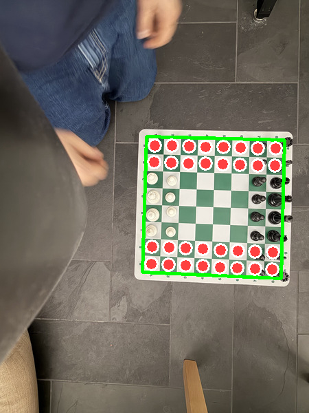 | 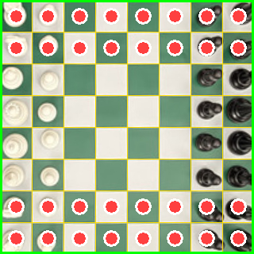 | initial | 32 | setup: +32 |
| 02-e4 | 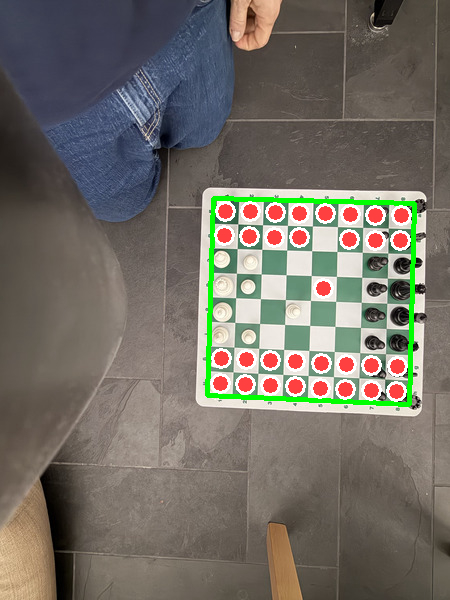 | 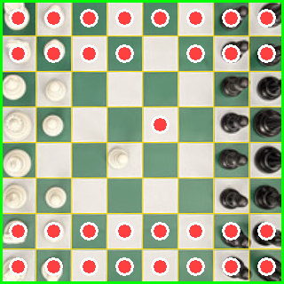 | e4 | 32 | 2 cells changed |
| 03-e6 | 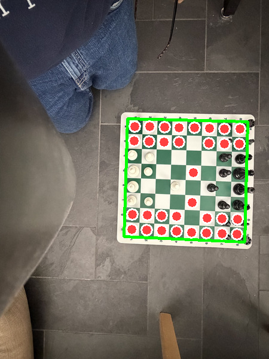 | 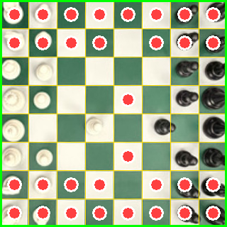 | e6 | 32 | 2 cells changed |
| 04-e5 | 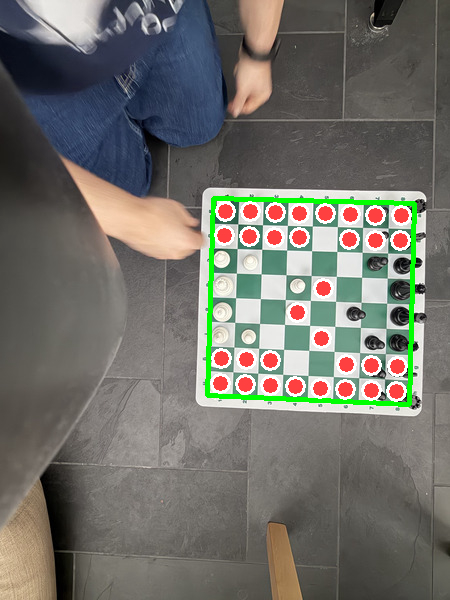 | 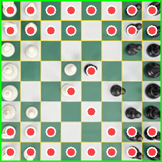 | e5 | 32 | 2 cells changed |
| 05-d4 | 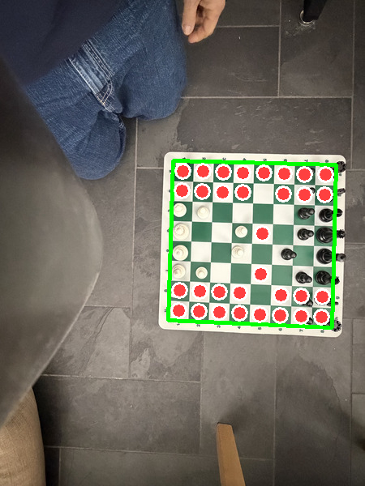 | 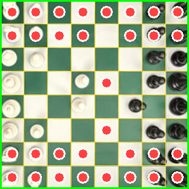 | d4 | 32 | 2 cells changed |
| 06-c5 | 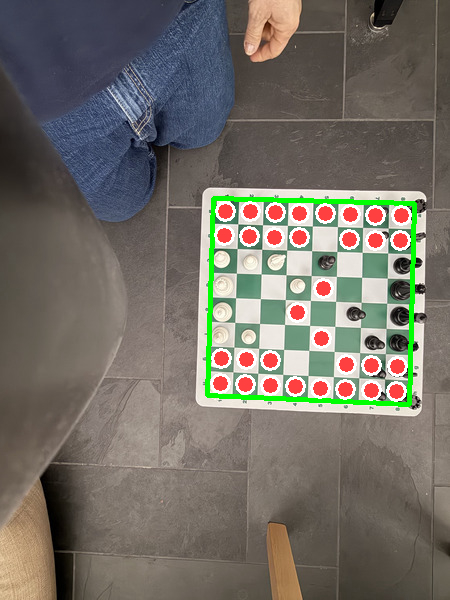 | 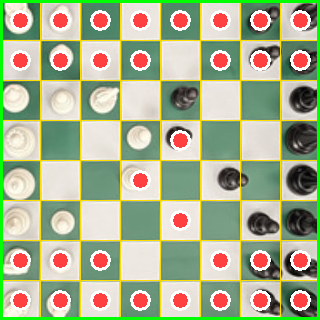 | c5 | 32 | 2 cells changed |
| 07-nc3 |  | 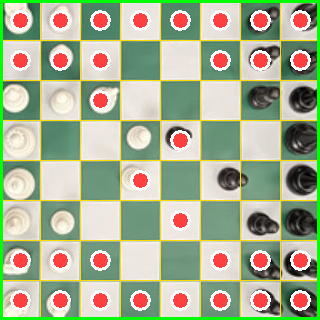 | Nc3 | 32 | 2 cells changed |
