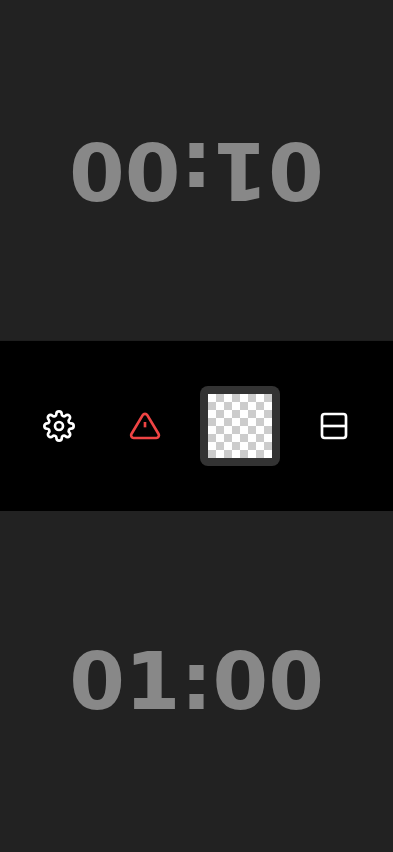
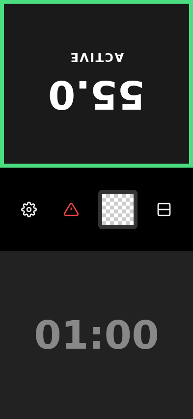
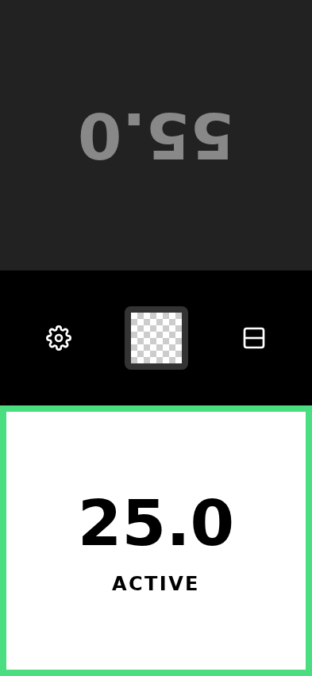
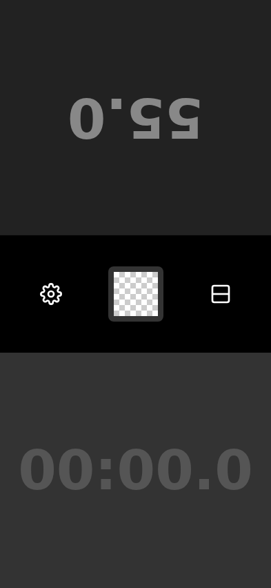
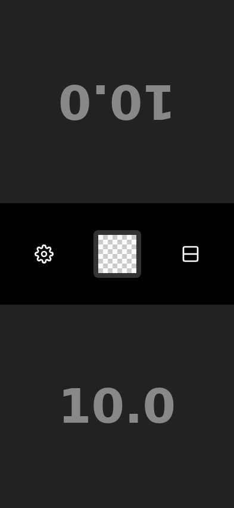
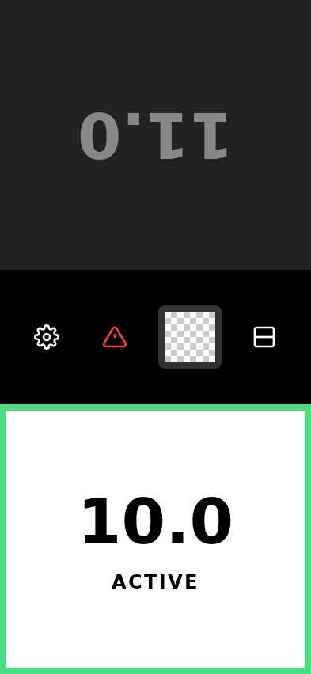

# Test: Game without increment

## Clock loaded in idle state

**Verifications:**
- [x] Both clocks show 01:00

---

## Black clock is ticking

**Verifications:**
- [x] Black clock shows 55.0

---

## White clock ticking and goes below 30s

**Verifications:**
- [x] White clock shows 25.0

---

## White runs out of time

**Verifications:**
- [x] White clock shows 00:00.0 and game is over

---

# Test: Game with increment

## Clock loaded in idle state with 10s base

**Verifications:**
- [x] Both clocks show 10.0

---

## Black clock got increment added

**Verifications:**
- [x] Black clock shows 11.0 (10 - 4 + 5)

---

