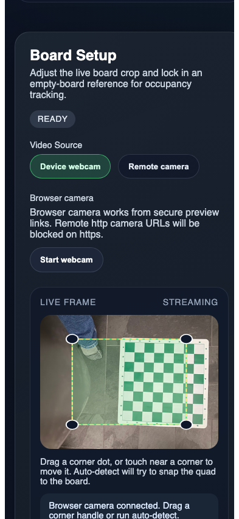
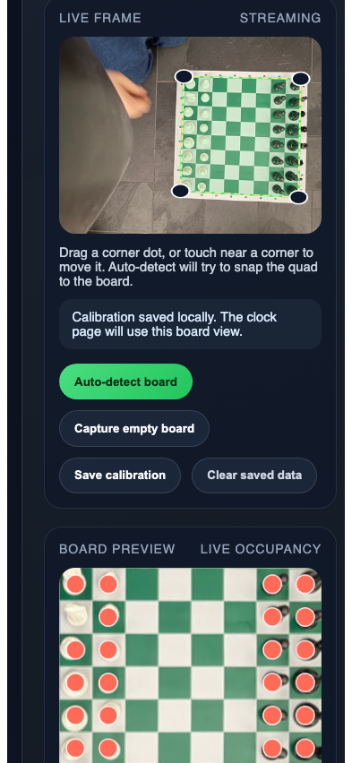

# Test: Setup screen works with the mocked webcam game frame

## Settings screen connects to the mocked webcam and shows the live game board frame

**Verifications:**
- [x] Live frame is streaming
- [x] Auto-detect becomes available once the webcam is live
- [x] The mocked webcam frame is `tests/images/game/empty.jpg`

---

## Setup screen runs the browser OpenCV contour detector, saves calibration, and tracks the initial setup occupancy

**Verifications:**
- [x] Board auto-detect updates the quad from the mocked webcam frame
- [x] Browser OpenCV contour detection finds the initial board quad from `tests/images/game/empty.jpg`
- [x] A detected corner handle can still be dragged afterward
- [x] The empty-board reference can be captured and saved locally
- [x] The occupancy threshold slider updates live and saves with calibration
- [x] Switching the mocked webcam to `tests/images/game/initial_setup.jpg` updates the live occupancy preview to 31 occupied squares at the shadow-resistant `3.5x` baseline

---
